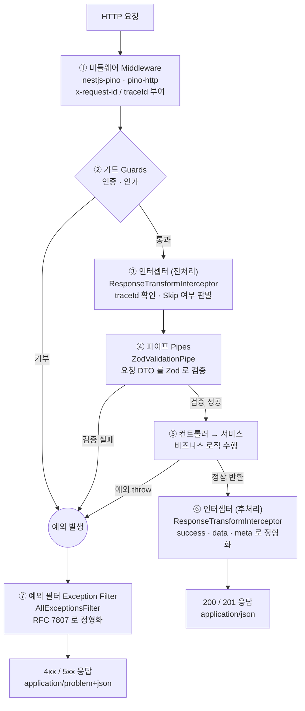

# NestJS 표준 통신 프로토콜 모노레포

이 프로젝트는 NestJS 모노레포 위에서 **RFC 7807 기반의 정형화된 HTTP 통신 프로토콜**을 구현한 템플릿입니다.
모든 API 는 하나의 일관된 파이프라인을 통해 **요청은 Zod 로 검증**하고, **성공 응답은 정형화된 구조**로,
**실패 응답은 RFC 7807 `application/problem+json`** 으로 정형화하여 반환합니다.

이벤트 기반(API → SQS → Worker → DB) 활동 수집 흐름과, PostgreSQL 기반 상품 관리·커머스 퍼널 분석 API를 함께 제공합니다.

## 주요 기술 스택

- **프레임워크**: [NestJS](https://nestjs.com/) (Monorepo, **webpack 빌더**)
- **언어**: [TypeScript](https://www.typescriptlang.org/)
- **타입 검사**: [Go 네이티브 TypeScript (`tsgo`, TS 7)](https://www.npmjs.com/package/@typescript/native-preview) — 빠른 `--noEmit` 검사에 사용 (툴체인 컴파일러는 TS 5 유지)
- **요청/응답 검증**: [Zod](https://zod.dev/) 및 `nestjs-zod`
- **에러 규격**: [RFC 7807 — Problem Details for HTTP APIs](https://datatracker.ietf.org/doc/html/rfc7807)
- **설정 관리**: `@nestjs/config` + Zod (타입 세이프 환경변수)
- **로깅**: [pino](https://getpino.io/) (`nestjs-pino`, 요청 추적 ID 상관관계)
- **데이터베이스**: [Prisma](https://www.prisma.io/) (PostgreSQL) + `prisma-erd-generator`
- **메시지 큐**: [AWS SQS v3 SDK](https://aws.amazon.com/sqs/) (LocalStack 연동)
- **API 문서화**: [Swagger (OpenAPI)](https://swagger.io/)
- **코드 품질**: [ESLint](https://eslint.org/) (Flat Config) · [Prettier](https://prettier.io/)

---

## 표준 통신 프로토콜

핵심은 [`libs/common-utils`](libs/common-utils) 의 `HttpProtocolModule` 하나로, 임포트하면 아래 3가지가 **전역**으로 활성화됩니다.

| 구성요소                              | 역할                                              |
| ------------------------------------- | ------------------------------------------------- |
| `ZodValidationPipe` (요청)            | 모든 요청 DTO(`createZodDto`)를 Zod 스키마로 검증 |
| `ResponseTransformInterceptor` (성공) | 정상 응답을 `{ success, data, meta }` 정형화      |
| `AllExceptionsFilter` (실패)          | 모든 예외를 RFC 7807 `problem+json` 으로 정형화   |

### 성공 응답 (정형화된 구조)

```jsonc
// 200/201
{
  "success": true,
  "data": {
    "id": "22222222-2222-2222-2222-222222222222",
    "sku": "SKU-001",
    "name": "상품 A",
    "priceInMinorUnits": 12000,
    "currency": "KRW",
    "stockQuantity": 10,
  },
  "meta": {
    "timestamp": "2026-07-23T00:00:00.000Z",
    "path": "/products",
    "traceId": "26229f8c-5697-4e72-b214-8f0aa039f083",
  },
}
```

> 헬스체크·파일 다운로드처럼 정형화된 응답이 불필요한 엔드포인트는 `@SkipResponseTransform()` 으로 제외할 수 있습니다.

### 실패 응답 (RFC 7807)

```jsonc
// 404  ·  Content-Type: application/problem+json
{
  "type": "https://example.com/problems/not-found",
  "title": "Not Found",
  "status": 404,
  "code": "NOT_FOUND",
  "timestamp": "2026-07-23T00:00:00.000Z",
  "detail": "상품을 찾을 수 없습니다: 22222222-2222-2222-2222-222222222222",
  "instance": "/products/22222222-2222-2222-2222-222222222222",
  "traceId": "fc0263b6-96eb-45b8-8ce4-a40bee23b6ea",
}
```

### 검증 에러 (Zod → RFC 7807)

요청 검증 실패는 `errors[]` 확장 멤버(RFC 7807 §3.2)로 **필드별 사유**까지 정형화됩니다.

```jsonc
// 400  ·  Content-Type: application/problem+json
{
  "type": "https://example.com/problems/bad-request",
  "title": "Bad Request",
  "status": 400,
  "code": "VALIDATION_FAILED",
  "detail": "요청 데이터가 유효성 검증을 통과하지 못했습니다.",
  "instance": "/products",
  "traceId": "…",
  "errors": [
    {
      "name": "sku",
      "reason": "SKU는 필수입니다.",
      "code": "too_small",
    },
    {
      "name": "priceInMinorUnits",
      "reason": "가격은 0 이상이어야 합니다.",
      "code": "too_small",
    },
  ],
}
```

> `traceId` 는 성공 응답의 `meta.traceId`, 에러 응답의 `traceId`, 그리고 로그가 모두 공유하는 값으로
> 응답 헤더 `x-request-id` 로도 반환되어 요청·응답·로그를 한 번에 추적할 수 있습니다.

---

## 요청 처리 파이프라인 (Guard → Interceptor → Pipe → Controller → Filter)

하나의 HTTP 요청이 들어와 응답이 나가기까지 NestJS 가 구성요소를 실행하는 순서와,
각 단계에서 이 프로젝트가 무엇을 하는지 정리한 흐름입니다.



> 핵심 규칙 — **정상 응답은 인터셉터가, 모든 실패 응답은 예외 필터가** 각각 단독으로 정형화합니다.
> 어느 단계(가드·파이프·컨트롤러)에서 예외가 발생하든 결국 `AllExceptionsFilter` 한 곳으로 모입니다.

### 현재 등록된 구성요소

세 가지 전역 구성요소(파이프·인터셉터·필터)는 모두
[`HttpProtocolModule`](libs/common-utils/src/http-protocol.module.ts) 이
`APP_PIPE` · `APP_INTERCEPTOR` · `APP_FILTER` 토큰으로 한 번에 등록합니다.
각 앱은 이 모듈만 `imports` 하면 동일한 파이프라인을 그대로 사용합니다.

| 유형      | 이름                           | 스코프                 | 위치                                                                                 | 역할                                                                                 |
| --------- | ------------------------------ | ---------------------- | ------------------------------------------------------------------------------------ | ------------------------------------------------------------------------------------ |
| 미들웨어  | `pino-http`                    | 전역                   | [libs/logger](libs/logger/src/logger.module.ts)                                      | 요청 로깅, `x-request-id`(traceId) 부여·응답 헤더 반환                               |
| 가드      | _(현재 커스텀 가드 없음)_      | —                      | —                                                                                    | 인증·인가 확장 지점. 필요 시 `@UseGuards()` 또는 `APP_GUARD` 로 추가                 |
| 인터셉터  | `ResponseTransformInterceptor` | 전역 `APP_INTERCEPTOR` | [common-utils](libs/common-utils/src/interceptors/response-transform.interceptor.ts) | 정상 응답을 `{ success, data, meta }` 로 정형화 (`@SkipResponseTransform()` 은 제외) |
| 파이프    | `ZodValidationPipe`            | 전역 `APP_PIPE`        | `nestjs-zod`                                                                         | `createZodDto` 요청을 Zod 스키마로 검증                                              |
| 예외 필터 | `AllExceptionsFilter`          | 전역 `APP_FILTER`      | [common-utils](libs/common-utils/src/filters/all-exceptions.filter.ts)               | 모든 예외를 RFC 7807 `problem+json` 으로 정형화                                      |

> 참고: 현재 요청 검증은 **가드가 아니라 전역 파이프(`ZodValidationPipe`)** 로 수행합니다.
> (`nestjs-zod` 의 `UseZodGuard` 를 쓰지 않고 파이프로 일원화)

### 아웃풋 정리

- **정상 경로** — `③ 인터셉터(전처리)` → `④ 검증` → `⑤ 핸들러` → `⑥ 인터셉터(후처리)`
  - 결과: `200/201` · `application/json` · `{ success, data, meta }` (위 _성공 응답_ 예시 참고)
  - `@SkipResponseTransform()` 이 붙은 핸들러(예: `GET /health`)는 정형화 없이 원본을 그대로 반환합니다.
- **실패 경로** — 어느 단계에서든 예외 발생 → `⑦ AllExceptionsFilter` 로 집결
  - `ZodValidationException` → `400` · `code: VALIDATION_FAILED` · `errors[]`(필드별 사유)
  - `HttpException`(예: `NotFoundException`) → 해당 상태코드 · `title` · `code` · `detail`
  - 그 외 예외 → `500` (운영 환경에서는 `detail` 을 숨김)
  - 공통: `Content-Type: application/problem+json`, `traceId` 포함 (위 _실패 응답_ 예시 참고)

---

## 프로젝트 구조

```
/
├── apps/
│   ├── api-server/       # 활동을 받아 SQS 로 발행하는 API 서버 (이벤트 발행자)
│   ├── activity-worker/  # SQS 를 폴링해 DB 에 적재하는 워커 (이벤트 소비자)
│   └── web-server/       # 표준 프로토콜을 보여주는 범용 HTTPS REST 서버
├── libs/
│   ├── common-utils/     # ★ 표준 통신 프로토콜 (RFC7807 필터·응답·검증 파이프)
│   ├── config/           # Zod 기반 타입 세이프 환경변수 모듈
│   ├── logger/           # pino 구조화 로깅 (요청 추적 ID)
│   ├── prisma-client/    # Prisma 스키마·클라이언트·ERD 자동생성
│   └── sqs-client/       # SQS 송/수신 공용 라이브러리
├── .github/workflows/    # CI/CD (수동 트리거 전용 — 자동 실행 안 됨)
├── docker/               # LocalStack 초기화 스크립트
├── Dockerfile            # APP 빌드 인자로 앱별 이미지 빌드
└── docker-compose.yml    # 로컬 인프라: LocalStack(SQS) + PostgreSQL
```

### 애플리케이션

- **`api-server`** (기본 포트 3000): 사용자 활동을 HTTP 로 받아 SQS FIFO 큐로 발행합니다. 표준 프로토콜 적용.
- **`activity-worker`**: SQS 를 롱 폴링하여 메시지를 Zod 로 재검증한 뒤 **Prisma 로 DB 에 적재**합니다. (HTTP 서버 없음)
- **`web-server`** (기본 포트 3002): PostgreSQL 기반 상품 CRUD와 상품별 전환 퍼널 관리 API를 제공하며, 설정으로 **HTTPS** 를 켤 수 있습니다.

### 커머스 관리 API

| 메서드   | 경로                      | 역할                                 |
| -------- | ------------------------- | ------------------------------------ |
| `POST`   | `/products`               | 상품 생성                            |
| `GET`    | `/products`               | 활성 상품 검색·페이지 조회           |
| `GET`    | `/products/:id`           | 활성 상품 단건 조회                  |
| `PATCH`  | `/products/:id`           | 상품 부분 수정                       |
| `DELETE` | `/products/:id`           | 상품 소프트 삭제                     |
| `GET`    | `/admin/analytics/funnel` | 기간·상품별 전환 퍼널 관리 지표 조회 |

상품 행동 이벤트는 `view_product`, `add_to_cart`, `purchase` 순서로 수집하며 `productId`가 필수입니다.
퍼널은 지정 기간의 원시 이벤트를 시간순으로 처리해 각 단계를 순서대로 완료한 고유 사용자 수와 전환율을 계산합니다.
소프트 삭제된 상품도 과거 분석 이력을 유지하기 위해 퍼널 조회 대상에 포함됩니다.

---

## 시작하기

### 사전 준비

- **[Node.js](https://nodejs.org/en/) 24 LTS** — 버전이 [`.nvmrc`](.nvmrc) / [`.node-version`](.node-version) / [`.mise.toml`](.mise.toml) 에 고정되어 있고, `package.json` 의 `engines` + `.npmrc` 의 `engine-strict` 로 **강제**됩니다. (24 미만에서는 설치가 거부됩니다.)
- [Docker](https://www.docker.com/) (LocalStack + PostgreSQL 로컬 인프라용)

> 버전 관리자(mise/nvm/fnm 등)를 쓰면 디렉터리 진입 시 자동으로 맞춰집니다.
>
> ```bash
> mise install && mise use   # mise
> nvm install && nvm use     # nvm (.nvmrc 사용)
> ```

### 1. 의존성 설치

```bash
npm install   # postinstall: Prisma Client 생성 · prepare: husky 훅 설치
```

### 2. 환경변수 준비

```bash
cp .env.example .env
```

### 3. 로컬 인프라 기동 (SQS + DB)

```bash
npm run docker:up          # LocalStack(SQS FIFO 큐 자동 생성) + PostgreSQL
npm run prisma:migrate     # DB 스키마 생성 (activity-worker + web-server)
```

### 4. 애플리케이션 실행

```bash
npm run start:dev web-server       # 범용 REST 서버   (http://localhost:3002)
npm run start:dev api-server       # 이벤트 발행 API  (http://localhost:3000)
npm run start:dev activity-worker  # SQS 소비 워커
```

Swagger UI: `http://localhost:3002/api-docs`, `http://localhost:3000/api-docs`

### 5. 빠른 확인

```bash
# 상품 생성
curl -s http://localhost:3002/products -X POST \
  -H 'Content-Type: application/json' \
  -d '{"sku":"SKU-001","name":"상품 A","priceInMinorUnits":12000,"currency":"KRW","stockQuantity":10}'

# 상품 조회 이벤트 발행
curl -s http://localhost:3000/activity/track -X POST \
  -H 'Content-Type: application/json' \
  -d '{"userId":"11111111-1111-1111-1111-111111111111","activityType":"view_product","productId":"<생성된 상품 UUID>","timestamp":"2026-07-23T00:00:00.000Z"}'

# 장바구니 추가와 구매 이벤트를 같은 userId/productId로 시간순 발행
curl -s http://localhost:3000/activity/track -X POST \
  -H 'Content-Type: application/json' \
  -d '{"userId":"11111111-1111-1111-1111-111111111111","activityType":"add_to_cart","productId":"<생성된 상품 UUID>","timestamp":"2026-07-23T00:01:00.000Z"}'

curl -s http://localhost:3000/activity/track -X POST \
  -H 'Content-Type: application/json' \
  -d '{"userId":"11111111-1111-1111-1111-111111111111","activityType":"purchase","productId":"<생성된 상품 UUID>","timestamp":"2026-07-23T00:02:00.000Z"}'

# activity-worker가 이벤트를 DB에 적재한 뒤 퍼널 조회
curl -G -s http://localhost:3002/admin/analytics/funnel \
  --data-urlencode 'productId=<생성된 상품 UUID>' \
  --data-urlencode 'from=2026-07-23T00:00:00.000Z' \
  --data-urlencode 'to=2026-07-24T00:00:00.000Z'
```

### HTTPS 로 실행하기 (web-server)

```bash
# 개발용 자체 서명 인증서 생성
mkdir -p certs
openssl req -x509 -newkey rsa:2048 -nodes -keyout certs/key.pem -out certs/cert.pem -days 365 -subj "/CN=localhost"

# .env 설정
# HTTPS_ENABLED=true
# HTTPS_KEY_PATH=./certs/key.pem
# HTTPS_CERT_PATH=./certs/cert.pem
```

---

## 개발 환경

### 빌드 · 품질 · 테스트

```bash
npm run build:all   # 세 앱을 webpack 으로 각각 자체 완결형 번들로 빌드
npm run lint        # ESLint (--fix) — import 정렬 포함
npm run typecheck   # Go 네이티브 TypeScript(tsgo) 로 --noEmit 타입 검사
npm run format      # Prettier
npm test            # 단위 테스트
npm run test:e2e    # api-server e2e
npx jest --config apps/web-server/test/jest-e2e.json   # web-server e2e
```

> `typecheck` 는 [tsconfig.typecheck.json](tsconfig.typecheck.json)(TS 7 호환) 을 사용합니다.
> TS 7 은 `baseUrl` 을 제거했기 때문에, 기존 툴체인(webpack·ts-jest·ESLint, TS 5)이 쓰는
> [tsconfig.json](tsconfig.json) 과 분리해 두었습니다. 필요 시 `npm run typecheck:tsc` 로 클래식 검사도 가능합니다.

### Git 훅 (커밋 검증) — husky + lint-staged

커밋할 때마다 아래가 **자동으로 강제 실행**되며, 하나라도 실패하면 커밋이 중단됩니다.
설정은 `npm install` 시 `prepare` 스크립트가 husky 훅을 자동으로 설치합니다.

1. **스테이징된 파일**에 ESLint(`--fix`) + Prettier(`--write`) 적용 → 수정분 자동 재스테이징 ([lint-staged](package.json) 설정)
2. **타입 검사** — `npm run typecheck` (Go 네이티브 `tsgo --noEmit`, 프로젝트 전체)
3. **단위 테스트** — `npm test`

훅 정의: [.husky/pre-commit](.husky/pre-commit)

### import 정렬 규칙

ESLint(`import/order` + `sort-imports`)가 아래 순서로 **자동 정렬**합니다. (`npm run lint` / 커밋 훅에서 적용)

1. Node 내장 모듈 (`crypto`, `fs` …)
2. 외부 패키지 (`@nestjs/*`, `zod` …)
3. 내부 라이브러리 (`@app/*`)
4. 상대 경로 (`./`, `../`)

각 그룹 사이는 빈 줄로 구분하고, **그룹 내부와 `{ … }` 멤버는 이름 A-Z** 로 정렬합니다.

### 데이터베이스 (Prisma)

```bash
npm run prisma:generate   # 클라이언트 + ERD 생성
npm run prisma:migrate    # 마이그레이션
npm run prisma:erd        # ERD 만 재생성 → libs/prisma-client/ERD.md
npm run prisma:studio     # Prisma Studio
```

> 스키마([libs/prisma-client/prisma/schema.prisma](libs/prisma-client/prisma/schema.prisma))가 바뀌면
> `prisma-erd-generator` 가 [libs/prisma-client/ERD.md](libs/prisma-client/ERD.md) 를 mermaid 다이어그램으로 자동 갱신합니다.

새 데이터베이스는 `npm run prisma:migrate`만 실행하면 됩니다. 기존에 `prisma db push`로 생성한 데이터베이스는
기존 테이블을 보존하면서 기준 마이그레이션을 적용된 것으로 등록한 뒤 증분 마이그레이션을 실행합니다.

```bash
npx prisma migrate resolve --applied 20260723000000_baseline
npm run prisma:migrate
```

### Docker 이미지 빌드

```bash
docker build --build-arg APP=web-server -t web-server .
docker build --build-arg APP=api-server -t api-server .
docker build --build-arg APP=activity-worker -t activity-worker .
```

### CI/CD

`.github/workflows` 의 워크플로우는 **실수로 자동 실행되지 않도록 수동 트리거(`workflow_dispatch`)로만** 설정되어 있습니다.

- **[ci.yml](.github/workflows/ci.yml)**: 설치 → Prisma 생성 → Lint → Build → 테스트. push/PR 자동화는 주석 해제로 활성화.
- **[cd.yml](.github/workflows/cd.yml)**: ECR 이미지 빌드/푸시 + ECS 배포 템플릿. 리포지토리 변수 `ENABLE_CD == 'true'` 일 때만 실제로 동작하는 안전장치 포함.

---

## 완료된 개선 항목

- [x] **표준 통신 프로토콜** — RFC 7807 에러 + 성공 응답 + Zod 검증을 하나의 일관된 파이프라인(`HttpProtocolModule`)으로 제공
- [x] **범용 HTTPS 웹 서버** — `web-server` 앱 추가
- [x] **데이터베이스 연동 (Prisma)** — `prisma-client` 라이브러리 추가, `activity-worker` 가 활동을 DB 에 적재
- [x] **ERD 자동 생성** — `prisma-erd-generator` 로 스키마 변경 시 ERD 갱신
- [x] **설정 관리 (ConfigModule)** — `@nestjs/config` + Zod 로 환경변수 타입 세이프 검증(부팅 시 fail-fast)
- [x] **로깅 시스템** — `pino` 구조화 로깅, 요청 추적 ID(`x-request-id`) 상관관계
- [x] **CI/CD 파이프라인 (템플릿)** — GitHub Actions (자동 실행되지 않는 수동 트리거)
- [x] **Node 버전 고정** — 최신 LTS(24) 를 mise/nvm + `engines`/`engine-strict` 로 강제
- [x] **커밋 게이트** — husky + lint-staged 로 커밋 시 Lint·Prettier·타입검사(tsgo)·테스트 강제
- [x] **Go 네이티브 타입 검사** — `tsgo`(TS 7) 로 `--noEmit` 검사
- [x] **AI 코드 리뷰 스펙** — [.coderabbit.yaml](.coderabbit.yaml) 로 CodeRabbit 리뷰 규칙 정형화

## 향후 개선 계획 (TODO)

- [ ] **TypeScript 7 전면 전환** — `typescript-eslint` 와 `ts-jest` 가 TS 7 을 지원하면(현재 각각 peer `<6.1.0`, `<7`) `typescript` 패키지째 7 로 승격하고 `tsconfig.typecheck.json` 을 `tsconfig.json` 으로 통합
- [ ] **`ttsc`(ttypescript) / `ts-patch` 도입 검토** — 커스텀 컴파일러 트랜스포머(예: 자동 DI 메타데이터, 배럴 최적화)가 필요해질 경우 `tsc` 대체 검토
- [ ] **CodeRabbit 활성화** — 리포지토리에 [CodeRabbit](https://coderabbit.ai) GitHub 앱을 설치하면 [.coderabbit.yaml](.coderabbit.yaml) 규칙대로 PR 자동 리뷰가 시작됨
- [ ] **CD 실배포 연결** — ECR/ECS 리소스 프로비저닝 및 GitHub Secrets/Variables 구성 후 `ENABLE_CD` 활성화
- [ ] **Dead Letter Queue (DLQ)** — 반복 실패 메시지 격리
- [ ] **관측성 강화** — 헬스체크(`@nestjs/terminus`), 메트릭(OpenTelemetry) 도입
