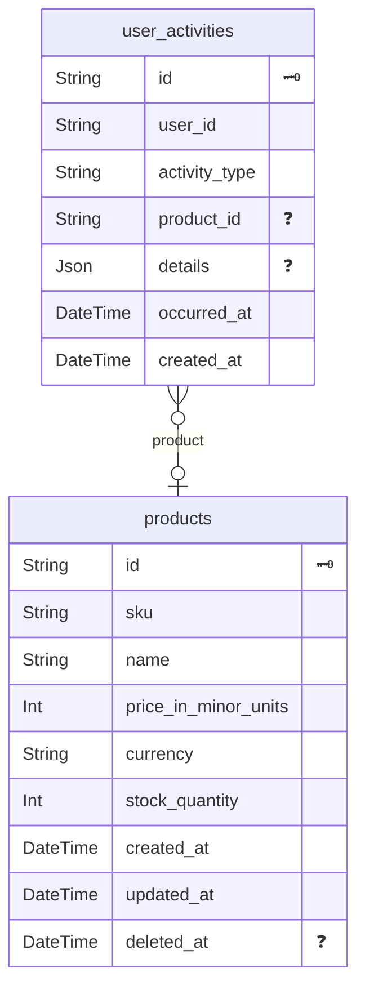

```mermaid
erDiagram

  "products" {
    String id "🗝️"
    String sku
    String name
    Int price_in_minor_units
    String currency
    Int stock_quantity
    DateTime created_at
    DateTime updated_at
    DateTime deleted_at "❓"
    }


  "user_activities" {
    String id "🗝️"
    String user_id
    String activity_type
    String product_id "❓"
    Json details "❓"
    DateTime occurred_at
    DateTime created_at
    }

    "user_activities" }o--|o products : "product"
```
